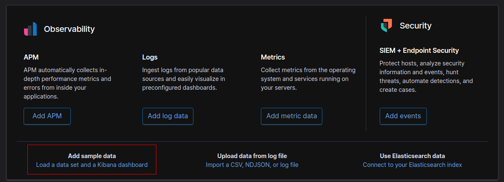

# Build Shiny Dashboard with Elasticsearch

This repository mainly demonstrates the method to integrate Elasticsearch data into a Shiny dashboard. The programming language used is mainly R and the back-end connection is done by using Python. Meanwhile for the data visualization part, graphs are drawn with three different graphing libraries in R, namely: *ggplot2*, *plotly* and *wordcloud2*.

The purpose for the whole demonstration is to:

1. Illustrates the utilization of data from Elasticsearch data ([**Amazon Elasticsearch Service**](https://aws.amazon.com/elasticsearch-service/))
2. Showcase the flexibilities and aesthetic of [Shiny dashboard](https://rstudio.github.io/shinydashboard/) to bring data to live **without much styling customizations**.

My Environment:

- R version 3.4.4
- Python 3.7.4
- Ubuntu 18.04

## Connect using Amazon Elasticsearch Service using Python Backend

Amazon Web Service (AWS) is a popular cloud computing platform for enterprises. Often when a company posses a vast amount of data and would like to make summary statistics or locate specific batch in a timely manner, they would be suggested to opt for adding Elasticsearch into their data infrastructure. A convenient to setup is to make use of Amazon Elasticsearch Service since it one would only need to take care of high-level parameters like number of shards. Moreover, a comprehensive documentation and sample codes are provided. However, as you may see from the [sample code](https://docs.aws.amazon.com/elasticsearch-service/latest/developerguide/es-request-signing.html) that the supporting languages has no R. There are various packages for Elasticsearch connection in R but the way **to integrate with Amazon Web Services version 4 authentication is not straight forward.** Thus this motivates me to find alternatives myself. 

To locate the Python path:

Method 1 (Enter the Python console using your environment):

```Python
import sys
# Python search for libraries at the ordering of the path
print(sys.path[0])
```

Method 2 (In Linux command line with your Python environment activated):

```shell
which python
```

This will located the system path for your Python executable.

Once you have the python path then you can setup the connection in your R script. In this demonstration, we will be using the reticulate package in R which provides a comprehensive set of tools for interoperability between Python and R. The details can be found [here](https://github.com/rstudio/reticulate) and you are recommended to read this awesome [cheat sheet](https://ugoproto.github.io/ugo_r_doc/pdf/reticulate.pdf)!

```R
library(reticulate)

# Connect to your python with python path
use_python("<PYTHONPATH>")
# import the libraries in Python
elasticsearch <- import("elasticsearch")
py_awsauth <- import("requests_aws4auth")

# Setup credentials and hosts
credentials <- data.frame(list('<key>', '<secret>', '<region>', '<service>'))
authr <- py_awsauth$AWS4Auth(credentials$key, credentials$secret, credentials$region, credentials$service)
colnames(credentials) <- c("key", "secret", "region", "service")
hosts = c("<domain>:<port>")

# Connect to the Amazon Elasticsearch Service
es <- elasticsearch$Elasticsearch(hosts = list(hosts), http_auth = authr,
                                  connection_class = elasticsearch$RequestsHttpConnection,
                                  use_ssl = TRUE, verify_certs = TRUE)
```

This simple way works! It is always a good idea to learn both R and Python to avoid being stuck.

The above code is recommended to be placed inside the *global.R* file since the connection is supposed to be a global object in the Shiny dashboard. 

## Our Example Connection

As we do not have a hosted Elasticsearch Instance at the moment. For demonstration purpose, lets make some sample data in the local machine:

1. Download and follow the instructions of [Elasticsearch](https://www.elastic.co/downloads/elasticsearch).
2. Download and follow the instructions of [Kibana.](https://www.elastic.co/downloads/kibana)
3. Host both Elasticsearch and Kibana.
4. Load the Sample Flight data to Kibana. Kibana is hosted on http://localhost:5601/.



5. Connect to Elasticsearch.

   ```R
   elasticsearch <- import("elasticsearch")
   host = "localhost:9200"
   es <- elasticsearch$Elasticsearch(hosts = host)
   ```

   There are various way for the connection since AWS4Auth is not used. You may use a R only approach as well.

6. Install the necessary packages for the Shiny dashboard.

7. Host the Shiny app in the R console:

   ```R
   runApp(host="0.0.0.0", port=1234)
   ```

8. Visit http://localhost:1234/ and you can view the demo dashboard.

   